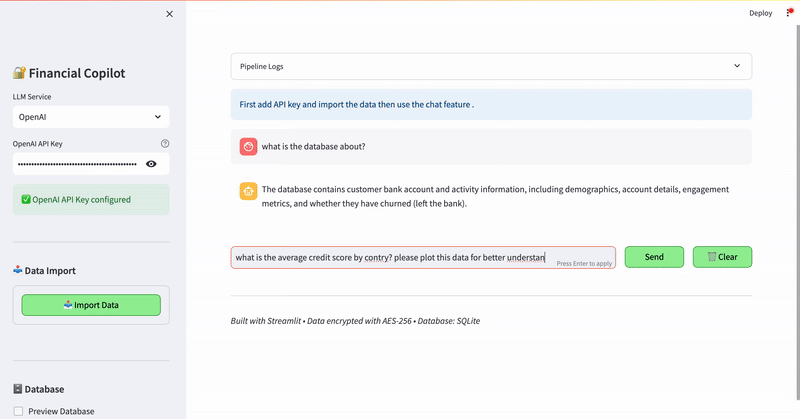

# Financial Copilot 🚀

**Conversational Analytics & Visualization with LLMs and Streamlit**

---

## Overview

**Financial Copilot** is an interactive analytics platform powered by Large Language Models (LLMs).  
Simply upload your financial data, connect your LLM provider (OpenAI or Groq), and start asking questions in natural language.  
The app automatically generates SQL queries, visualizes results as charts (bar, pie, line, scatter), and provides clear insights—all in a secure Streamlit interface.

---
## 📽 Demo



---

## Features

- 🔍 **Conversational Data Analytics:** Query your data using plain English.
- 🤖 **Automated SQL Generation:** LLMs translate your questions into SQL behind the scenes.
- 📊 **Dynamic Visualizations:** Instantly plot bar, pie, line, and scatter charts based on your queries.
- 🔐 **Data Encryption:** Sensitive fields are encrypted before storage.
- 🗃️ **Secure Local Database:** Stores your data in SQLite for fast access.
- 🌐 **Multi-Provider LLM Support:** Works with both OpenAI and Groq APIs.
- ⚡ **No-code Setup:** Everything runs in your browser via Streamlit—no coding required.

---

## 🧪 Try These Sample Questions

Ask any of these to get started:

- "What is the database about?"
- "What is the  average credit score by country? please plot this data for better understanding"
- "Plot a bar chart comparing number of customers who churned vs who didn't"

---

## Quickstart

### 1. Clone the Repository

```bash
git clone https://github.com/yourusername/financial-copilot.git
cd financial-copilot
```

### 2. Install Dependencies

```bash
pip install -r requirements.txt
```

### 3. Launch the App

```bash
streamlit run app.py
```

### 4. Configure

- **API Keys:** Enter your OpenAI(Recommended) or Groq API key in the sidebar after launch.
- **Import Data:** Use the UI to upload your CSV (see [Data Format](#data-format) below).
- **Start Chatting:** Ask questions and visualize your data.

---

## Data Format

The app currently uses CSV format with the following columns (example):

```csv
customer_id,credit_score,country,gender,age,tenure,balance,products_number,credit_card,active_member,estimated_salary,churn
15634602,619,France,Female,42,2,0,1,1,1,101348.88,1
...
```
if you upload an new CSV provide a detailed explanation of your data (e.g. what does each column mean), example is provided in the code.

**Note:** Additional synthetic fields (e.g., email, phone, join_date) will be generated during the import pipeline for demonstration purposes.

---

## Project Structure

```
financial-copilot/
├── app.py               # Main Streamlit application
├── requirements.txt     # Required Python packages
├── data/                # Place your CSV files here
├── db/                  # Local SQLite database
├── utils/               # Helper functions
├── README.md
└── ...
```

---

## Customization

- **Adding Chart Types:** Edit `plot_chart()` in `utils/plotting.py` to add new chart types.
- **Extending Data Fields:** Update data processing logic in `app.py`.

---

## Troubleshooting

- **Missing API Key:** Ensure your key is correct and has usage quota.
- **Data Import Issues:** Check your CSV format matches the expected columns.
- **Visualization Errors:** Make sure your question results in an aggregated or grouped table (not raw data).

---

## Contributing

Pull requests are welcome! For major changes, please open an issue first to discuss what you’d like to change.

---

## License

This project is licensed under the MIT License. See [LICENSE](LICENSE) for details.

---

## Acknowledgments

- [Streamlit](https://streamlit.io)
- [OpenAI](https://openai.com)
- [Groq](https://groq.com)
- [Pandas](https://pandas.pydata.org/)
- [Matplotlib](https://matplotlib.org/)
